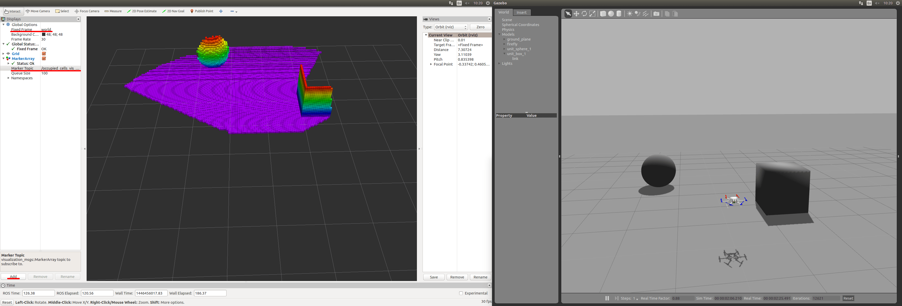

# 使用 ROS/Gazebo Classic 的 OctoMap 三维模型

[OctoMap 库](http://octomap.github.io/) 是一个开源库，用于从传感器数据生成体积三维环境模型。这些模型数据可用于无人机的导航和避障。

本指南介绍如何将 _OctoMap_ 与 [Gazebo Classic](../sim_gazebo_classic/index.md) [Rotors Simulator](https://github.com/ethz-asl/rotors_simulator/wiki/RotorS-Simulator) 和 ROS 一起使用。

## 安装

安装需要 ROS、[Gazebo Classic](../sim_gazebo_classic/index.md) 以及 Rotors Simulator 插件。请按照 [Rotors Simulator 指南](https://github.com/ethz-asl/rotors_simulator) 进行安装。

接下来安装 _OctoMap_ 库：

```sh
sudo apt-get install ros-indigo-octomap ros-indigo-octomap-mapping
rosdep install octomap_mapping
rosmake octomap_mapping
```

打开 `~/catkin_ws/src/rotors_simulator/rotors_gazebo/CMakeLists.txt` 文件，并在文件末尾添加以下内容：

```sh
find_package(octomap REQUIRED)
include_directories(${OCTOMAP_INCLUDE_DIRS})
link_libraries(${OCTOMAP_LIBRARIES})
```

打开 `~/catkin_ws/src/rotors_simulator/rotors_gazebo/package.xml` 文件，并添加以下行：

```xml
<build_depend>octomap</build_depend>
<run_depend>octomap</run_depend>
```

运行以下两行命令：

::: info
第一行命令将默认 Shell 编辑器更改为 _gedit_。建议对 _vim_（默认编辑器）不熟悉的用户使用，否则可以省略。
:::

```sh
export EDITOR='gedit'
rosed octomap_server octomap_tracking_server.launch
```

并修改以下两行内容：

```xml
<param name="frame_id" type="string" value="map" />
...
<!--remap from="cloud_in" to="/rgbdslam/batch_clouds" /-->
```

修改为：

```xml
<param name="frame_id" type="string" value="world" />
...
<remap from="cloud_in" to="/firefly/vi_sensor/camera_depth/depth/points" />
```

## 运行仿真

在三个 _独立_ 的终端窗口中运行以下三行命令。这将启动 [Gazebo Classic](../sim_gazebo_classic/index.md)、_Rviz_ 以及一个 OctoMap 服务器。

```sh
roslaunch rotors_gazebo mav_hovering_example_with_vi_sensor.launch  mav_name:=firefly
rviz
roslaunch octomap_server octomap_tracking_server.launch
```

在 _Rviz_ 中，将窗口左上角的 'Fixed Frame' 从 'map' 改为 'world'。然后点击左下角的添加按钮，选择 MarkerArray。双击 MarkerArray 并将 'Marker Topic' 从 `/free_cells_vis_array` 改为 `/occupied_cells_vis_array`。

此时你应该能看到部分地面。

在 _Gazebo Classic_ 窗口的红色旋翼前方插入一个立方体，你应该能在 _Rviz_ 中看到它。

