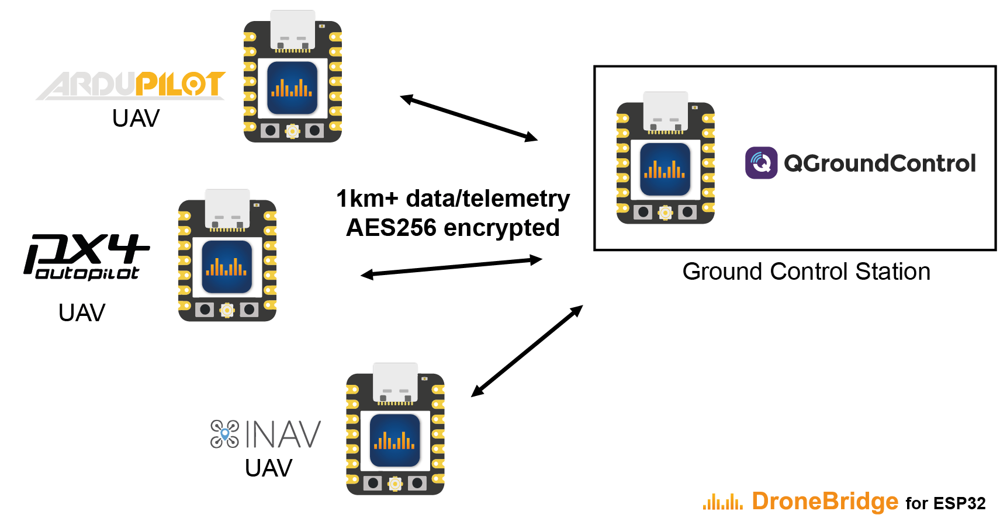

# ESP32 WiFi模块# 概述

ESP32 是常见的 Wi-Fi 模块，具备专用的 UART、SPI 和 I2C 接口，以及完整的 TCP/IP 协议栈和微控制器功能。
它们通常没有固件，但可安装 _DroneBridge for ESP32_ 以将其启用为透明的、双向的串口到 Wi-Fi 桥接器。
这使得它们可以作为 [Wi-Fi 遥测](../telemetry/telemetry_wifi.md) 模块与任何 Pixhawk 系列控制器配合使用。

它们还可以在一种特殊的 ESP-NOW 模式下使用，该模式在降低数据速率的情况下可实现 1 公里以上的通信距离。

典型通信距离取决于天线和环境：

- Wi-Fi 模式：约 50m-200m
- ESP-NOW 模式：300m-1km+

### Wi-Fi 网络

_DroneBridge for ESP32_ 支持标准 Wi-Fi 连接到接入点，也可作为独立接入点运行。

### ESP-NOW 网络

ESP-NOW 模式提供了一种无连接且加密的替代传统 Wi-Fi 的方式。
虽然数据速率降低至 <250 kbit/s，但通信距离可延长至 1 公里。
此模式对连接的自动驾驶仪客户端数量没有限制，仅受信道容量和处理能力限制客户端数量。

::: info
ESP-NOW 模式需要地面控制站（GCS）侧和自动驾驶仪侧均使用 ESP32 设备。
:::

## 功能

- 双向传输：串口转WiFi、串口转WiFi长距离（LR）模式、串口转ESP-NOW链路
- 支持MAVLink、MSP、LTM或任何使用透明模式的载荷协议
- 性价比高、可靠且低延迟
- 重量：< 8g
- 标准WiFi模式下最大传输距离150米
- ESP-NOW或WiFi LR模式下最大传输距离1公里（发送端与接收端必须为启用LR-Mode的ESP32）
- 全模式加密（包括ESP-NOW广播），使用AES-GCM 256位加密技术
- 支持几乎任意规模的无人机蜂群，通过ESP-NOW的定制加密广播模式实现
- 受支持平台：QGroundControl、Mission Planner、mwptools、impload等
- 易于安装：电源连接+飞控的UART连接
- 通过易用的网页界面完全可配置
- 支持LTM和MSPv2协议解析，提升连接可靠性并减少数据包丢失
- 支持MAVLink协议解析，通过注入无线电状态数据包实现在地面站显示RSSI
- 完全透明的下行遥测选项

::: info
[您可以在官方网站找到关于当前版本_DroneBridge for ESP32_的所有最新信息。](https://dronebridge.github.io/ESP32/)
:::

## 推荐硬件

_DroneBridge for ESP32_ 可在几乎所有 ESP32 开发板上运行。  
建议使用带有外部天线接口的开发板和模块，因为这些设备可以提供更远的通信距离。

:::warning
某些 ESP32 模块支持 3.3V 电源输入，而许多飞控输出为 5V（例如 Pixhawk 4）。  
需要检查兼容性并根据需要降低电压。
:::

::: tip
_DroneBridge for ESP32_ 项目推荐使用 [官方支持和测试的开发板](https://dronebridge.github.io/ESP32/)。  
这些开发板体积小巧、价格低廉、配备可连接 Pixhawk 飞控的 Pixhawk 标准接口，并预装 _DroneBridge for ESP32_ 固件。
:::

已与 _DroneBridge for ESP32_ 版本测试过兼容性（但未获得官方支持）的其他 ESP32 开发板：

- [ESP32-C3-DevKitM-1](https://docs.espressif.com/projects/esp-dev-kits/en/latest/esp32c3/esp32-c3-devkitm-1/index.html)  
- [ESP32-S3-DevKitC-1](https://docs.espressif.com/projects/esp-dev-kits/en/latest/esp32s3/esp32-s3-devkitc-1/index.html)  
- [NodeMCU ESP32S](https://www.waveshare.com/nodemcu-32s.htm)

## 安装/更新固件

官方网站提供了一个[易于使用的在线烧录工具](https://dronebridge.github.io/ESP32/install.html)。
使用基于Chrome的浏览器，通过USB将ESP32连接到计算机，然后点击烧录！

更多详细的烧录说明请参见 [DroneBridge for ESP32 > 安装](https://dronebridge.gitbook.io/docs/dronebridge-for-esp32/installation) (DroneBridge Docs)。

## 接线

当使用官方板载Pixhawk飞控时，只需将ESP32的`TELEM1`接口提供的线缆插入飞控的`TELEM1`或`TELEM2`端口即可。

对于没有`TELEM`端口的ESP板，需要手动将其连接到飞控的串口（例如`TELEM1`或`TELEM2`）。下图展示了接线方式的示意图。

- 将ESP32的UART连接到飞控的UART（例如`TELEM1`或`TELEM2`端口）  
  确保电压电平匹配！  
- RX接TX  
- GND接GND  
- 为ESP32提供稳定的3.3V或5V电源（取决于ESP32的输入接口和飞控的供电能力）  
- 将飞控端口设置为MAVLINK 1或2协议  

::: info

- 遵循ESP32板的制造商关于供电的建议。  
  某些板在同时连接5V电源且USB线缆连接到ESP32开发板的USB/串口桥接器时可能出现问题。  
- 部分ESP32开发套件制造商在其产品上标注了错误的引脚标签。  
  如果遇到问题，请确认板载引脚的标注是否正确。

:::

## 配置 PX4

配置连接到 ESP32 的飞控器端口，将其协议设置为 MAVLink，并确保波特率与 ESP32 一致。  
Pixhawk 的 `TELEM1` 和 `TELEM2` 端口默认配置为 [MAVLink](../peripherals/mavlink_peripherals.md#default-mavlink-ports) 协议，但仍需手动设置速率。

对于 `TELEM1`，可以设置如下参数：

- `SER_TEL1_BAUD`: 115200 8N1  
- `MAV_0_RATE`: 24000（可选择性提高）

如需更多信息或使用其他端口，请参阅 [MAVLink 外设](../peripherals/mavlink_peripherals.md) 和 [串口配置](../peripherals/serial_configuration.md)。

## 配置DroneBridge for ESP32

烧录_DroneBridge for ESP32_后，设备将初始创建一个WiFi接入点供连接。连接成功后可通过浏览器访问配置页面，地址为`http://dronebridge.local`或`192.168.2.1`。

_DroneBridge for ESP32_的默认配置应能直接连接PX4。对于官方HW1.x板的配置为：`UART TX Pin: 5`，`UART RX Pin: 4`，`UART RTS Pin: 6`，`UART CTS Pin: 7`

唯一可能需要配置的是确保ESP32与飞控的波特率匹配。

若需使用ESP32的不同引脚、修改WiFi配置或调整包大小，可更改这些设置。较低的包大小意味着更高的系统开销和负载，但延迟更低且丢失数据包后的恢复速度更快。

### 支持的模式

| **MavLink Index** | **DroneBridge for ESP32 Mode** | **Encryption** | **Description**                                                                                                                                          | **Notes**                                                                                                                                                                 |
| ----------------- | ------------------------------ | -------------- | -------------------------------------------------------------------------------------------------------------------------------------------------------- | ------------------------------------------------------------------------------------------------------------------------------------------------------------------------- |
| 1                 | WiFi Access Point Mode         | WPA2 PSK       | ESP32使用802.11b速率启动经典WiFi接入点                                                                                             | 任何WiFi设备均可连接                                                                                                                                               |
| 2                 | WiFi Client Mode               | min. WEP       | ESP32连接到现有WiFi接入点。支持LR Mode                                                                                       | 加密方式由接入点定义。多个无人机可连接到一个AP和GCS。802.11b速率                                                                          |
| 3                 | WiFi Access Point Mode LR      | WPA2 PSK       | ESP32使用espressif的LR模式启动WiFi接入点                                                                                           | 仅ESP32 LR Mode启用设备可检测并连接。数据速率为0.25Mbit。传输距离大幅增加。                              |
| 4                 | ESP-NOW LR Mode AIR            | AES256-GCM     | ESP32能接收区域内任何GCS的ESP-NOW广播包并转发到UART。向所有地面站广播。   | 无连接协议。数据速率为0.25Mbit。相比WiFi模式传输距离大幅增加。ESP-NOW广播和协议的自定义加密模式。 |
| 5                 | ESP-NOW LR Mode GND            | AES256-GCM     | ESP32能接收区域内任何无人机的ESP-NOW广播包并转发到UART。向所有空中站广播。 | 无连接协议。数据速率为0.25Mbit。相比WiFi模式传输距离大幅增加。ESP-NOW广播和协议的自定义加密模式。    |

通过GCS和MavLink参数协议而非Web界面更改模式时，`MavLink Index`对应参数`SYS_ESP32_MODE`的编号。

## 配置地面控制站

QGroundControl 应该会自动检测连接，无需进一步操作（_DroneBridge for ESP32_ 会自动通过 UDP 将所有连接的 WiFi 设备数据转发到 14550 端口）。

可用的连接选项如下：

- 通过 `14550` 端口向所有连接设备进行 UDP 单播。
- 通过 `5760` 端口进行 TCP 连接。

### REST API

DroneBridge for ESP32 提供 REST API，允许读取和写入配置选项。

更多信息请参见：[DroneBridge for ESP32 > Developer & API Documentation](https://dronebridge.gitbook.io/docs/dronebridge-for-esp32/developer-and-api-documentation)。

## 故障排除

请参见[故障排除与帮助](https://dronebridge.gitbook.io/docs/dronebridge-for-esp32/troubleshooting-help) (DroneBridge Docs)。